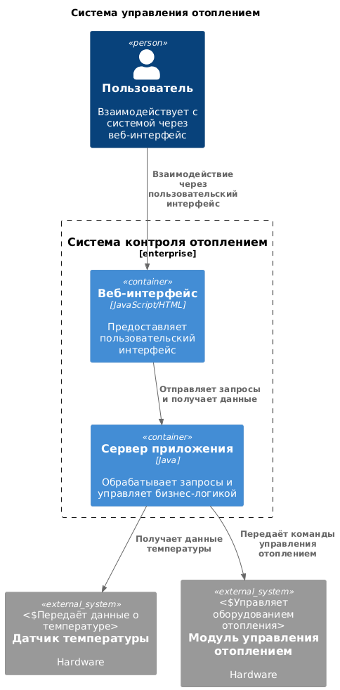
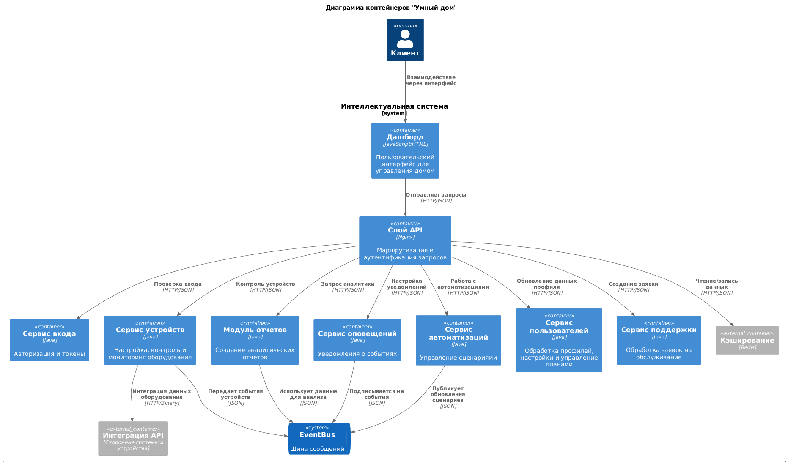
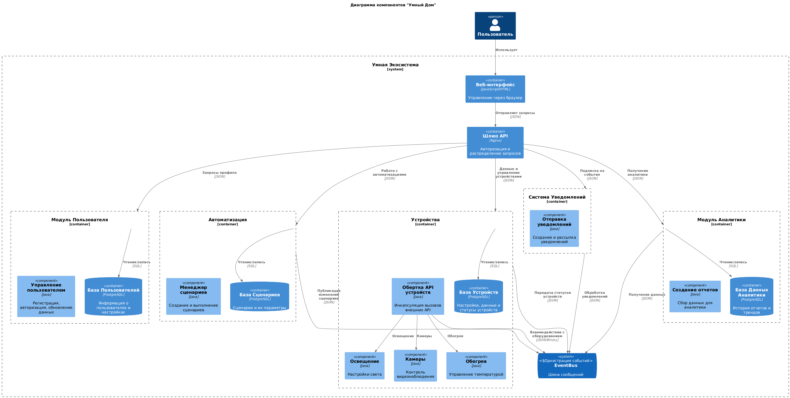
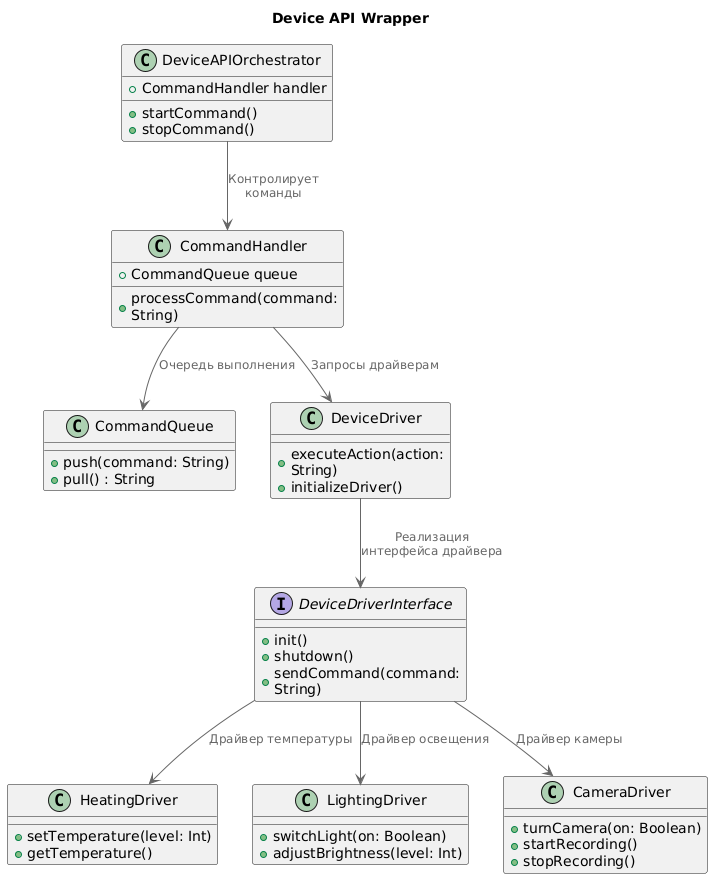
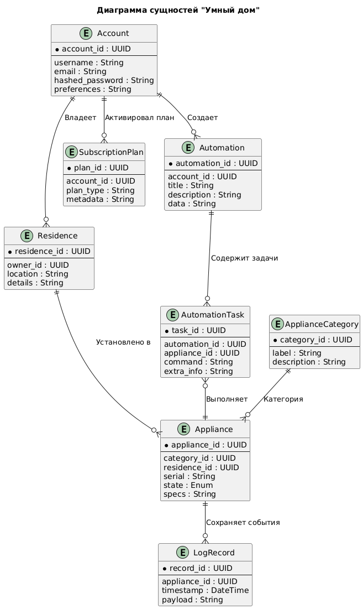

# Задание 1. Анализ и планирование

### 1. Описание функциональности монолитного приложения

**Управление отоплением:**

- **Функциональность:** Пользователи могут удалённо включать или выключать отопление в своих домах.
- **Техническая реализация:** Запросы от пользователей отправляются на сервер, который управляет состоянием подключённых модулей отопления через синхронные вызовы.
- **Условия:** Подключение модулей осуществляется специалистом компании.

**Мониторинг температуры:**

- **Функциональность:** Система получает данные о температуре с датчиков, установленных в домах, и отображает текущую температуру в веб-интерфейсе.
- **Техническая реализация:** Данные температуры передаются от датчиков на сервер по запросу через синхронные соединения.

### 2. Анализ архитектуры монолитного приложения

- **Язык программирования:** Java
- **База данных:** PostgreSQL
- **Архитектура:** Монолитная, включает обработку запросов, бизнес-логику и работу с базой данных в одном приложении.
- **Взаимодействие:** Синхронное, запросы выполняются последовательно, что создаёт ограничения по масштабируемости.
- **Развёртывание:** Требует полной остановки приложения, так как архитектура монолита не поддерживает гибкое обновление отдельных компонентов.
- **Масштабируемость:** Ограничена, так как добавление новых функций требует изменения всей системы.

### 3. Определение доменов и границы контекстов

**Выделенные домены**:
1. **Домен "Управление устройствами":**
    - Управление отоплением, освещением, автоматическими воротами.
    - Настройка сценариев работы.
2. **Домен "Мониторинг":**
    - Получение телеметрии с устройств (температура, видеонаблюдение).
3. **Домен "Пользовательский интерфейс":**
    - Веб-интерфейс для управления системой.
    - Настройка и управление экосистемой пользователями.
4. **Домен "Подключение устройств":**
    - Подключение новых устройств к системе через стандартные протоколы.
5. **Домен "Системная поддержка":**
    - Обслуживание системы клиентскими специалистами и разработка новой функциональности.

### **4. Проблемы монолитного решения**

1. **Масштабируемость:**
    - Невозможно масштабировать отдельные части системы (например, мониторинг или управление) отдельно от остальных компонентов.
2. **Устаревшая архитектура:**
    - Отсутствие микросервисного подхода делает сложным добавление новых функций без внесения изменений в основной код.
3. **Сложности с развёртыванием:**
    - Обновление системы требует её полной остановки, что может привести к длительным простоям.
4. **Отсутствие асинхронности:**
    - Синхронное взаимодействие между компонентами ограничивает производительность, особенно при увеличении количества подключённых устройств.
5. **Отсутствие модели самообслуживания:**
    - Пользователи не могут самостоятельно подключать устройства, что увеличивает затраты на сопровождение и замедляет процесс подключения.
6. **Ограничения бизнес-целей:**
    - Невозможность масштабирования под более крупные экосистемы (например, добавление световых или наблюдательных устройств) без серьёзной переработки системы.

Если вы считаете, что текущее решение не вызывает проблем, аргументируйте свою позицию.

### 5. Визуализация контекста системы — диаграмма С4

# Задание 2. Проектирование микросервисной архитектуры

**Диаграмма контейнеров (Containers)**

**Диаграмма компонентов (Components)**

**Диаграмма кода (Code)**

# Задание 3. Разработка ER-диаграммы

